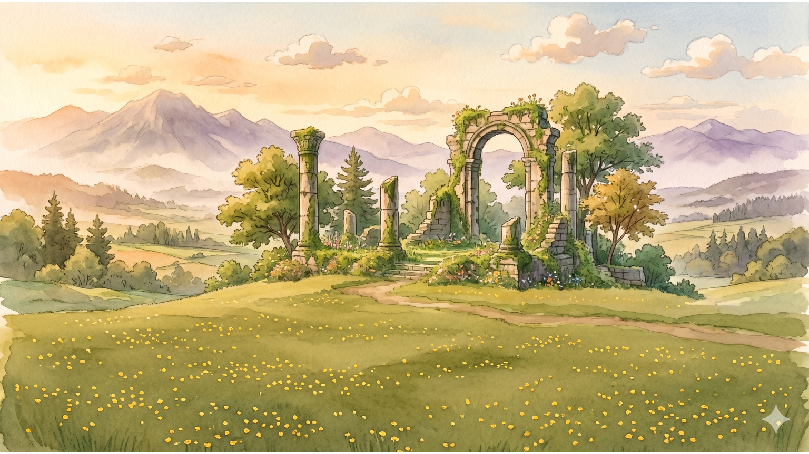

# 🧭 기하 탐험대 1차시 — 화물 운송 대작전

초등학교 평면도형의 이동(평행이동) 학습용 게이미피케이션 웹 게임.
지브리(토토로)풍 수채화 배경 + 픽셀아트 도형 + 소코반 메커니즘.

> "사악한 마법사가 흩뿌린 유물(도형)을 정해진 자리로 운송하라."



## 🎮 게임 특징

- **20 스테이지 / 5 티어** — 기초(A) → 방향조합(B) → 장애물(C) → 다화물(D) → 마스터(E)
- **4가지 도형** — 사각형 · 삼각형 · 원 · 오각형
- **모바일/태블릿 지원** — 가상 D-패드 + 액션 버튼 (햅틱 피드백 포함)
- **핵심 학습 메시지** — "어떤 모양이든 평행이동 시 모양·크기는 변하지 않고 위치만 바뀐다"

## 📚 학습 흐름

| 티어 | 단계 | 학습 포인트 |
|---|---|---|
| **A 기초** | 1·2·3·4 | 4방향 밀기, 반대편 접근, 장거리 |
| **B 방향조합** | 5·6·7·8 | ㄱ/ㄴ/ㄷ자 운송, 좁은 통로 |
| **C 장애물** | 9·10·11·12 | 우회, 미궁, 코너 함정 |
| **D 다화물** | 13·14·15·16 | 두 화물 분류, **원 등장**, **오각형 등장**, 순서 |
| **E 마스터** | 17·18·19·20 | 사총사, 종합, 보스 |

## 🕹 조작법

| 데스크톱 | 모바일/태블릿 |
|---|---|
| ↑↓←→ 또는 WASD : 이동 | 화면 좌측 D-패드 |
| R : 다시하기 | 화면 우측 "다시" 버튼 |
| ESC : 메뉴 | 화면 우측 "메뉴" 버튼 |
| Enter : 클리어 후 다음 | 화면 탭 |

## 🚀 실행

```bash
npm install
npm run dev      # http://localhost:5277
npm run build    # 프로덕션 빌드 → dist/
npm run preview  # 빌드 결과 미리보기
```

## 🏗 기술 스택

- **Vite + React 18 + TypeScript**
- **Canvas 2D** (Phaser.js 사용 안 함, 격자 퍼즐엔 과함)
- **나노바나나/Imagen 생성 수채화 배경 + 코드 픽셀 오브젝트**

## 📁 디렉토리 구조

```
mumu도형/
├── 차시별_계획.md           # 8차시 전체 교안 (1차시 본 게임)
├── public/
│   └── assets/
│       ├── PROMPTS.md       # 제미나이 이미지 프롬프트
│       ├── bg_ancient_field.png
│       ├── tile_grass/dirt/stone.png
│       └── char_down/up/side.png
├── src/
│   ├── App.tsx              # 인트로/선택/엔딩 라우팅
│   ├── main.tsx
│   └── game/
│       ├── Scene.tsx        # 메인 게임 씬 (Canvas 2D)
│       ├── TouchControls.tsx# 모바일 가상 컨트롤
│       ├── pixel.ts         # 지브리 픽셀 헬퍼
│       ├── sprites.ts       # 캐릭터·도형·장애물 스프라이트
│       ├── stages.ts        # 20 스테이지 데이터
│       ├── logic.ts         # 소코반 규칙 + 애니메이션
│       └── assets.ts        # 이미지 로더 (코드 폴백 지원)
└── README.md
```

## 🎨 비주얼 가이드 (지브리 픽셀 월드)

- 384×216 logical, PX=4 → 1536×864 표시
- **검정 그림자 금지** — `#1a1428` 보라 그림자 사용
- 따뜻한 앰버/올리브 톤, 노이즈 0.025
- 골 자리: 황금 룬 돌타일 + 도형 종류별 컬러 헤일로

## 🧩 스테이지 코드 매핑

```
.    빈 칸
#    장애물(돌)
P    플레이어
S/s  사각형 화물 / 골
T/t  삼각형 화물 / 골
O/o  원 화물 / 골
N/n  오각형 화물 / 골
```

## 📜 라이선스 / 크레딧

- **계획·디자인**: Gemini 8차시 가이드 + 게이미피케이션
- **에셋 이미지**: Gemini Imagen (배경·타일·캐릭터)
- **코드**: Claude + 사용자 협업
